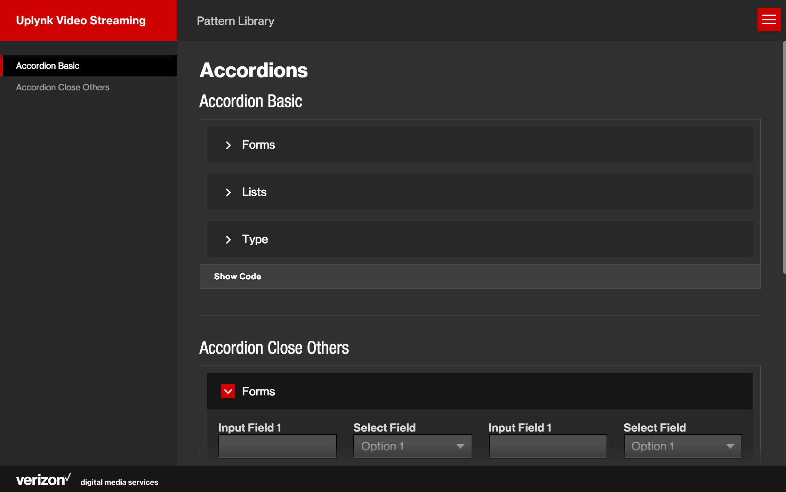

# Using the &lt;compose&gt; Tag

The `<compose>` tag let's you dynamically insert custom components. We have seen some questions arise as to when exactly to use the `<compose>` tag. Most of the time you know what component you want to use, so you don't need to set it dynamically. This article will show two real-world examples of where we are using it in our code.


## Pattern Library

Our UI/UX team has developed a pattern library with code examples for our team to use. This lets us keep our styles consistent as we develop new pages.

The way we have it set up, each of the pages has a similar design and layout. Each pattern category is in a directory called `patterns`. There is a directory for each pattern with a similar structure. 

So here is an excerpt of `app.js`:

```js
export class App {
    configureRouter(config, router) {
        config.addPipelineStep('authorize', AuthorizeStep);
        this.router = router;
        config.title = 'Pattern Library';
        config.map([
            {
                route: '',
                name: 'intro',
                moduleId: './patterns/intro/index',
                nav: true,
                title: 'Intro',
            },
            {
                route: 'accordions',
                name: 'accordions',
                moduleId: './patterns/accordions/index',
                nav: true,
                title: 'Accordions',
            },
            ...
```

So you can see our Accordions section is located in `patterns/accordions`

Here is the `patterns/accordions/index.html` component. 

```html
<template>
    <require from="../../components/pattern-index"></require>

    <pattern-index title="Accordions" patterns="accordions/patterns" links.bind="links"></pattern-index>
</template>
```

Notice we are importing a `pattern-index` component. Here is what that component looks like:

pattern-index.html:

```html
<template>
    <div class="fader-side-bar  fader-side-bar--top"></div>
    <div class="layout__middle__side">
        <div class="layout__middle__side__inner">
            <ul class="nav  nav--stacked">
                <li class="${link.class}" repeat.for="link of links" ><a click.delegate="subNavActivate($index)" href="#${link.href}">${link.title}</a></li>
                <li class="push-bottom-medium"></li>
            </ul>
        </div>
    </div>
    <div class="fader-side-bar  fader-side-bar--bottom"></div>

    <div class="layout__middle__main">
        <h1>${title}</h1>
        <compose view="../patterns/${patterns}.html"></compose>
    </div>
</template>
```

pattern-index.js

```js
import {bindable, containerless} from 'aurelia-framework';

@containerless
export class PatternIndex {
    @bindable title = 'INCLUDE TITLE ATTRIBUTE';
    @bindable patterns;
    @bindable links;

    subNavActivate(index) {
        const linkCount = this.links.length;

        for (let i = 0; i < linkCount; i += 1) {
            this.links[i].class = '';
        }

        this.links[index].class = 'active';
        return true;
    }
}
```

So for the purpose of this article, there are really only two things to highlight. Here is where we are calling the `pattern-index` component:

```html
<pattern-index title="Accordions" patterns="accordions/patterns" links.bind="links"></pattern-index>
```

Notice we pass in the `patterns` attribute.

And this is how we use the compose tag in the component:

```html
<compose view="../patterns/${patterns}.html"></compose>
```

So basically we replacing the `<compose>` tags with the `patterns/accordions/patterns.html` component, which looks like this:

```html
<template>
     <require from="./accordion-basic"></require>
     <require from="./accordion-close-others"></require>

    <accordion-basic></accordion-basic>
    <accordion-close-others></accordion-close-others>
</template>
```
Here is an example of the accordion page:




## Data Table

We won't go so deep into this one, but basically give you a high level overview.

We have a `<data-table>` component in our system where you can bind an array of objects and basically print them out in a table. It is a very useful component and we use it in a number of places. 

The problem is that sometimes you might want a column that doesn't have anything to do with your data. For example, we have one table that has a menu of actions for each row of data. This column is only applicable to this particular data array.


So how do we add this in to our table? Here is what our `data-cell.html` portion of our component looks like:

```html
<template>
    <require from="./record-value"></require>

    <div data-th.bind="col.label" get-class.call="col.getClass(record)" class.bind="cls">
        <compose if.bind="col.view" view.bind="col.view" view-model.bind="col.viewModel" model.bind="{record: record}"></compose>
        <record-value if.bind="!col.view" prop.bind="record[col.key]" record.bind="record" get-value.call="col.getValue(record)" title="${col.getValue(record)}"></record-value>
    </div>
</template>
```

Standard data in the array will use the `<record-value>` component, but if we want to we can specify a `view` and `view-model` to use for this column and it will be generated in this column. 

We could probably refactor this code to have the `<compose>` render the `<record-value>` component if a view and view-model are not specified. Then we can remove the `if.bind` and simply have the `<compose>` tag there.